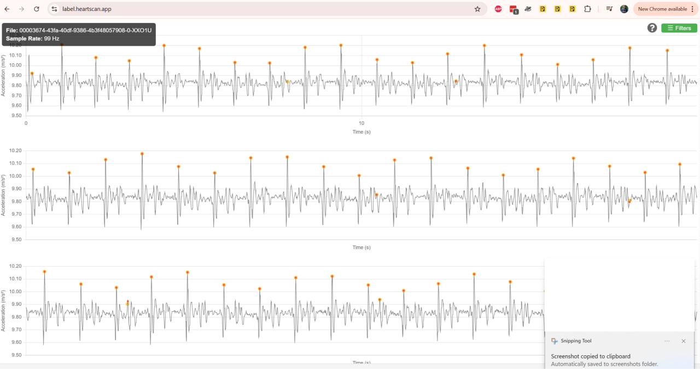

# OpenSCG — Open-Source Cardiac Graph Infrastructure

Turn any smartphone into a live seismocardiography (SCG) sensor that doctors can watch in real time during a telemedicine call.

---

## ⚡ TL;DR

**Problem:** Telemedicine still lacks objective cardiac data – doctors rely on words, not signals.

**Solution:** OpenSCG streams raw accelerometer data from a patient’s phone and renders heartbeat waveforms for the clinician in seconds – no app install, no extra hardware.

**Scope:** Patient PWA, ingestion API, live viewer, JSON spec, Docker deploy, MIT/Apache OSS. Proprietary ML module (peaks, arrhythmia) will be commercial/optional.

**Status:** Specification locked, code scaffolding next. Contributors welcome.

---

## 📑 Table of Contents

1. [Why It Matters](#1-why-it-matters)
2. [User Workflows](#2-user-workflows)
3. [System Overview](#3-system-overview)
4. [Architecture Snapshot](#4-architecture-snapshot)
5. [Feature Roadmap](#5-feature-roadmap)
6. [Tech Stack](#6-tech-stack)
7. [Getting Started (Development)](#7-getting-started-development)
8. [Data Format – OpenSCG JSON v0.1](#8-data-format--openscg-json-v01)
9. [Licensing & Commercial Use](#9-licensing--commercial-use)
10. [Contributing](#10-contributing)
11. [Screenshots](#%EF%B8%8F-screenshots)
12. [Testing / CI](#-testing--ci)
13. [Roadmap / Issues](#-roadmap--issues)
14. [Contact](#contact)

---

## 1. Why It Matters
- **Zero hardware barrier.** SCG uses the phone you already own.
- **True vital sign.** Waveform shows mechanical heart motion – something video chat cannot.
- **Fills the telehealth gap.** Adds objective data before expensive RPM devices arrive.
- **Research booster.** Creates the first global open dataset of in-home SCG.

---

## 2. User Workflows

**Patient**
- Opens `https://openscg.org/` on phone (PWA).
- Create new session and get URL for viewing data.
- Places device on chest (mid-sternum or apex).
- Taps Start – sensor data streams instantly.

**Clinician**
- Opens link in browser.
- Watches real-time waveform + BPM counter.
- Ends session → data stored for later review.

_No logins for MVP – tokenised URL is the key._

---

## 3. System Overview

- **Patient side (Browser):** A Progressive Web App (PWA) captures raw accelerometer data.
- **Backend Server (FastAPI):** Acts as a high-performance, real-time message broker and data archiver.
  - **Live Broadcast:** Immediately relays raw data to viewers via WebSockets.
  - **Data Persistence:** Buffers data in memory during the session and writes it to PostgreSQL when the session ends.
- **Viewer (Clinician side):** A React web app that receives the live data stream (and any buffered historical data on connection) and performs client-side interpolation and rendering.
- **REST API:** Provides endpoints to create sessions and retrieve full, raw data for completed sessions.
- **ML layer (Future):** An optional, proprietary module for advanced signal analysis.

---

## 4. Architecture Snapshot

```
+----------------+      +----------------------+      +----------------+
|                |      |                      |      |                |
|  Patient Phone |----->|  FastAPI Backend     |----->| Viewer Browser |
| (PWA)          |      | (WebSocket & Buffer) |      | (React/Plotly) |
|                |      |                      |      |                |
+----------------+      +----------+-----------+      +----------------+
                                   |
                                   | (Write on Session End)
                                   |
                         +---------v---------+
                         |                   |
                         |    PostgreSQL     |
                         |   (Raw Samples)   |
                         |                   |
                         +-------------------+
```

- **Real-time Transport:** WebSockets for low-latency, bi-directional communication.
- **On-demand Transport:** A REST API for retrieving session data.
- **Processing:** Interpolation and rendering are handled on the client-side (viewer's browser).

### API Endpoints

- `POST /api/v1/sessions`: Creates a new measurement session.
- `POST /api/v1/sessions/{id}/end`: Ends a session and saves the buffered data.
- `GET /api/v1/sessions/{id}/data`: Retrieves all saved raw data for a completed session.
- `GET /health`: A health check endpoint that verifies the server and database connection status.
- `WS /ws/{id}`: The real-time WebSocket endpoint.

---

## 5. Feature Roadmap

| Phase         | Time      | Deliverables                                                      |
|-------------- |---------- |-------------------------------------------------------------------|
| Phase 1: OSS MVP | 0–2 months | Minimal ingestion API, React viewer, hosted deployment, OpenSCG JSON spec |
| Phase 2: Pilots  | 2–6 months | UI polish, BPM/RMS stats, iframe/API embed, feedback loop         |
| Phase 3: ML Integration | 6–12 months | AO/AC detection module (proprietary), triage scoring, interpretation API |

---

## 6. Tech Stack

**Frontend**
- Next.js / React (PWA, no install)
- Plotly.js for graphing
- Tailwind CSS for styling

**Backend**
- API: FastAPI (async, Python)
- Real-time: WebSockets
- Storage: PostgreSQL for all session and raw signal data.
- Security: Anonymous access with unguessable UUIDs for session links. Rate limiting is enforced.

**DevOps**
- CI/CD: GitHub Actions
- Backend Deployment: Docker + Azure Container Apps
- Frontend Deployment: Vercel

---

## 7. Getting Started (Development)

For a complete guide on setting up a local development environment, including instructions for mobile testing, please see the [**Development Setup Guide**](./docs/DEV_SETUP.md).

---

## 8. Data Format – OpenSCG JSON v0.1

**Sample Data Format**

The API uses the following format for accelerometer data points:

```json
{
  "t": 1743256991352,
  "ax": -5.2,
  "ay": 0.3,
  "az": 8.4
}
```

- `t`: Unix timestamp in milliseconds (int)
- `ax`, `ay`, `az`: Accelerometer readings (float)

See the full API contract in `docs/API_CONTRACT.yml`.

---

## 9. Licensing & Commercial Use

- **Code and protocol:** Apache 2.0 – free for OSS and non-commercial use
- **ML analytics layer:** Closed-source. Contact us for OEM / licensing deals.

---

## 10. Contributing

Check issues → pick “good first issue” or open a proposal

Fork → PR → keep commits atomic, write tests

No drama — just quality commits

See `CONTRIBUTING.md` for details.

---

---

## 🖼️ Screenshots

### Real-time SCG stream (prototype)



### Zoomed-in waveform view


---

## 🧪 Testing / CI

Tests coming soon. Planned stack:
- `pytest` for backend
- `playwright` or `vitest` for frontend
- GitHub Actions for CI

---

## 📂 Roadmap / Issues

📬 [View active issues](https://github.com/HeartScan/openSCG/issues)

🗺️ Roadmap will be tracked via GitHub Projects

---

## Contact

- Email: team@heartscan.app
- Website: https://heartscan.app

Maintained by the HeartScan team — Warsaw, Poland
