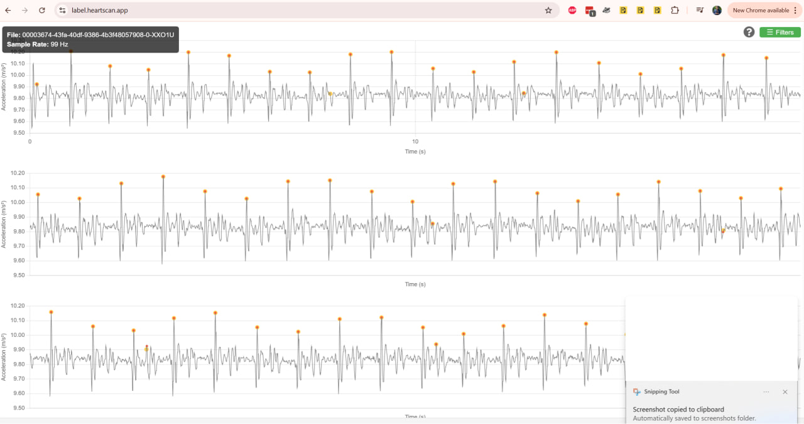

# OpenSCG — Open-Source Cardiac Graph Infrastructure

Turn any smartphone into a live seismocardiography (SCG) sensor that doctors can watch in real time during a telemedicine call.

---

## ⚡ TL;DR

**Problem:** Telemedicine still lacks objective cardiac data – doctors rely on words, not signals.

**Solution:** OpenSCG streams raw accelerometer data from a patient’s phone and renders heartbeat waveforms for the clinician in seconds – no app install, no extra hardware.

**Scope:** Patient PWA, ingestion API, live viewer, JSON spec, Docker deploy, MIT/Apache OSS. Proprietary ML module (peaks, arrhythmia) will be commercial/optional.

**Status:** Specification locked, code scaffolding next. Contributors welcome.

---

## 📑 Table of Contents

1. [Why It Matters](#why-it-matters)
2. [User Workflows](#user-workflows)
3. [System Overview](#system-overview)
4. [Architecture Snapshot](#architecture-snapshot)
5. [Feature Roadmap](#feature-roadmap)
6. [Tech Stack](#tech-stack)
7. [Getting Started (Development)](#getting-started-development)
8. [Data Format – OpenSCG JSON v0.1](#data-format--openscg-json-v01)
9. [Licensing & Commercial Use](#licensing--commercial-use)
10. [Contributing](#contributing)
11. [Screenshots](#-screenshots)
12. [Testing / CI](#-testing--ci)
13. [Roadmap / Issues](#-roadmap--issues)
14. [Contact](#contact)

---

## 1. Why It Matters

- **Zero hardware barrier.** SCG uses the phone you already own.
- **True vital sign.** Waveform shows mechanical heart motion – something video chat cannot.
- **Fills the telehealth gap.** Adds objective data before expensive RPM devices arrive.
- **Research booster.** Creates the first global open dataset of in-home SCG.

---

## 2. User Workflows

**Patient**
- Opens `https://openscg.live/` on phone (PWA).
- Create new session and get URL for viewing data.
- Places device on chest (mid-sternum or apex).
- Taps Start – sensor data streams instantly.

**Clinician**
- Opens link in browser.
- Watches real-time waveform + BPM counter.
- Ends session → data stored for later review.

_No logins for MVP – tokenised URL is the key._

---

## 3. System Overview

- **Patient side (Browser):** Web app captures accelerometer data from smartphone.
- **Backend ingestion server:** Receives, buffers, interpolates, and stores SCG time series.
- **Live session API:** Enables authorized access to in-progress or completed sessions.
- **Viewer (Doctor side):** Real-time or asynchronous waveform viewer + basic statistics (BPM).
- **Data persistence layer:** Sessions stored in PostgreSQL + optional blob storage.
- **ML layer (optional, closed-source in future):** Detect AO/AC peaks, artifacts, arrhythmia patterns.

---

## 4. Architecture Snapshot

```
Phone (JS PWA)  →  /stream-chunk  →  Ingestion Buffer  →  SSE Polling  →  React Viewer
(acc x,y,z JSON)              |                       (FastAPI)            (Plotly.js)
                              ↓
                         PostgreSQL + S3
```

- **Transport:** REST POST for chunks, Server-Sent Events for viewer.
- **Latency target:** <250 ms end-to-end on free tier hosting.

---

## 5. Feature Roadmap

| Phase         | Time      | Deliverables                                                      |
|-------------- |---------- |-------------------------------------------------------------------|
| Phase 1: OSS MVP | 0–2 months | Minimal ingestion API, React viewer, hosted deployment, OpenSCG JSON spec |
| Phase 2: Pilots  | 2–6 months | UI polish, BPM/RMS stats, iframe/API embed, feedback loop         |
| Phase 3: ML Integration | 6–12 months | AO/AC detection module (proprietary), triage scoring, interpretation API |

---

## 6. Tech Stack

**Frontend**
- Patient app: Next.js / React (PWA, no install)
- Doctor viewer: React / TypeScript (SPA)
- Graphing: D3.js or Plotly.js

**Backend**
- API: FastAPI or Starlette (async, Python)
- Ingestion: REST endpoint (POST /stream-chunk) with batched JSON data
- Storage: PostgreSQL (session metadata), S3-compatible blob (optional raw stream)
- Realtime view: Server-sent events (SSE) or polling
- Security: Token-based auth + link-based access (no login required in pilot)

**DevOps**
- Deployment: Docker + Fly.io / Render / GCP App Engine
- Monitoring: Prometheus + Grafana (optional)

---

## 7. Getting Started (Development)

```sh
# clone
$ git clone https://github.com/HeartScan/openSCG.git
$ cd openSCG

# spin up dev stack
$ docker compose up --build

# open viewer
$ open http://localhost:3000
```

_Requires Docker 24+._

See `docs/DEV_SETUP.md` for details. _(TODO: Add this file)_

---

## 8. Data Format – OpenSCG JSON v0.1

**Current raw data format (as collected):**

```json
[
  {
    "ax": -5.2,
    "ay": 0.3,
    "az": 8.4,
    "timestamp": 1743256991352
  },
  {
    "ax": -5.3,
    "ay": 0.3,
    "az": 8.4,
    "timestamp": 1743256991361
  },
  // ... more samples ...
]
```

- `ax`, `ay`, `az`: Accelerometer readings (float)
- `timestamp`: Unix timestamp in milliseconds (int)

**Planned OpenSCG JSON spec (for API and storage):**

```json
{
  "session_id": "uuid",
  "device": "Pixel 6",
  "sampling_rate": 50,
  "data": [
    {"t": 0.00, "x": -0.012, "y": 0.001, "z": 0.098},
    {"t": 0.02, "x": -0.011, "y": 0.002, "z": 0.097}
  ]
}
```

> **Note:** The ingestion API will accept the raw array format and wrap it with session/device metadata for storage and downstream processing.

See full spec in `docs/openscg-format.md`. _(TODO: Add this file)_

---

## 9. Licensing & Commercial Use

- **Code and protocol:** Apache 2.0 – free for OSS and non-commercial use
- **ML analytics layer:** Closed-source. Contact us for OEM / licensing deals.

---

## 10. Contributing

Check issues → pick “good first issue” or open a proposal

Fork → PR → keep commits atomic, write tests

No drama — just quality commits

See `CONTRIBUTING.md` for details. _(TODO: Add this file)_

---

## 🧠 Looking to contribute?

We’re actively looking for collaborators to help with:

- Real-time signal viewer (React + Plotly.js)
- FastAPI ingestion logic
- Docker deployment templates
- Defining the OpenSCG JSON spec

Join the project early and help define the open SCG standard!

---

## 🖼️ Screenshots

### Real-time SCG stream (prototype)



### Zoomed-in waveform view


---

## 🧪 Testing / CI

Tests coming soon. Planned stack:
- `pytest` for backend
- `playwright` or `vitest` for frontend
- GitHub Actions for CI

---

## 📂 Roadmap / Issues

📬 [View active issues](https://github.com/HeartScan/openSCG/issues)

🗺️ Roadmap will be tracked via GitHub Projects

---

## Contact

- Email: team@heartscan.app
- Website: https://heartscan.app

Maintained by the HeartScan team — Warsaw, Poland 